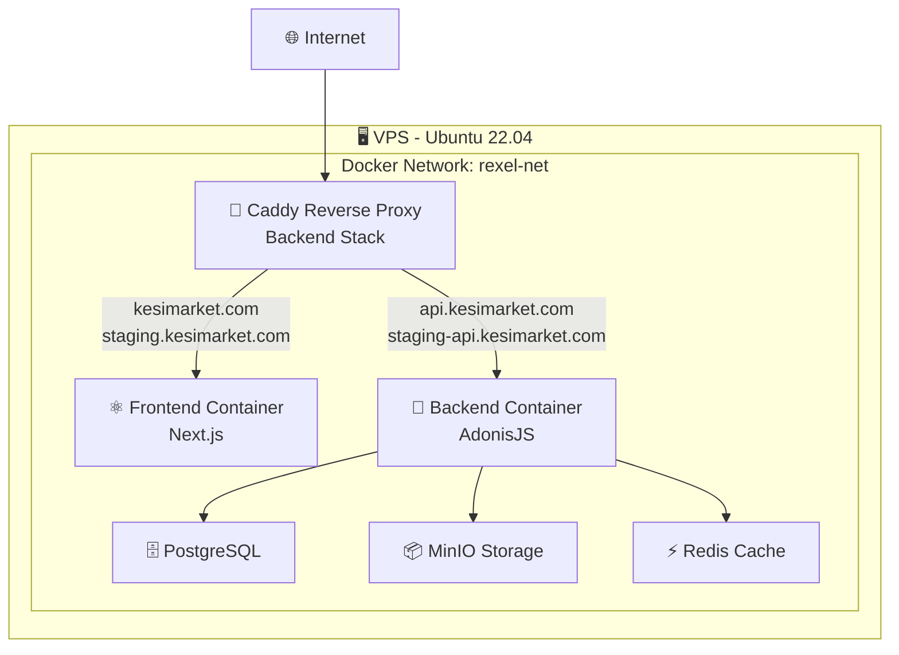

# 🚀 Déploiement Partagé - Frontend & Backend

Ce guide explique la nouvelle architecture de déploiement où **Caddy** (reverse proxy) est centralisé sur le backend et gère à la fois le frontend et l'API.

## 📋 Architecture

### Vue d'ensemble



### Domaines configurés

| Environnement | Frontend | API |
|---------------|----------|-----|
| **Production** | `kesimarket.com` | `api.kesimarket.com` |
| **Staging** | `staging.kesimarket.com` | `staging-api.kesimarket.com` |

## 🔧 Configuration

### 1. Réseau Docker Partagé

Les deux applications utilisent le réseau Docker `rexel-net` :

```bash
# Création du réseau (une seule fois)
docker network create rexel-net

# Ou utiliser le script automatique
./scripts/setup-docker-network.sh
```

### 2. Backend (avec Caddy)

Le backend inclut Caddy qui gère les deux applications :

```yaml
# rexel-modern-backend/docker-compose.prod.yml
networks:
  rexel-net:
    external: true

services:
  caddy:
    # Gère TOUS les domaines
    # kesimarket.com → frontend:3000
    # api.kesimarket.com → app:3333
```

### 3. Frontend (sans Caddy)

Le frontend ne contient plus Caddy, juste l'application Next.js :

```yaml
# rexel-modern/docker-compose.prod.yml
networks:
  rexel-net:
    external: true

services:
  frontend:  # Nom important pour Caddy
    image: rexel-frontend-prod:latest
```

## 🚀 Workflow de Déploiement

### Étape 1 : Setup initial (une seule fois)

```bash
# Sur le VPS
./scripts/setup-docker-network.sh
```

### Étape 2 : Déploiement Backend

```bash
# Depuis GitHub Actions ou manuellement
cd ~/rexel-modern/backend
docker-compose -f docker-compose.prod.yml up -d
```

### Étape 3 : Déploiement Frontend

```bash
# Depuis GitHub Actions ou manuellement  
cd ~/rexel-modern/frontend
docker-compose -f docker-compose.prod.yml up -d
```

## 🔄 GitHub Actions

### Workflows modifiés

Les workflows GitHub Actions déploient maintenant :

1. **Backend Workflow** (`rexel-modern-backend`)
   - Build l'image backend
   - Déploie avec Caddy
   - Configure tous les domaines

2. **Frontend Workflow** (`rexel-modern`)
   - Build l'image frontend  
   - Déploie sur le réseau partagé
   - Se connecte automatiquement à Caddy

### Variables secrets GitHub

```bash
# Backend (existantes)
VPS_HOST=your.vps.ip
VPS_USER=ubuntu
VPS_SSH_KEY=your_private_key

# Frontend (nouvelles)
VPS_HOST=your.vps.ip  
VPS_USER=ubuntu
VPS_SSH_KEY=your_private_key
```

## 📁 Structure des dossiers VPS

```
~/rexel-modern/
├── backend/
│   ├── images/           # Images Docker backend
│   ├── logs/            # Logs Caddy (tous domaines)
│   ├── uploads/         # Fichiers application
│   ├── minio-data/      # Stockage MinIO
│   └── backups/         # Sauvegardes DB
└── frontend/
    └── images/          # Images Docker frontend
```

## ⚙️ Variables d'environnement

### Production (rexel-modern/.env.production)

```bash
NEXT_PUBLIC_API_URL=https://api.kesimarket.com
NEXTAUTH_URL=https://kesimarket.com
NEXT_PUBLIC_SITE_URL=https://kesimarket.com
```

### Staging (rexel-modern/.env.staging)

```bash
NEXT_PUBLIC_API_URL=https://staging-api.kesimarket.com
NEXTAUTH_URL=https://staging.kesimarket.com
NEXT_PUBLIC_SITE_URL=https://staging.kesimarket.com
```

## 🛡️ Sécurité Caddy

### Features configurées

- ✅ **SSL automatique** avec Let's Encrypt
- ✅ **Rate limiting** différentiel (prod vs staging)
- ✅ **Headers de sécurité** complets
- ✅ **CORS** configuré par environnement
- ✅ **Compression** Gzip/Brotli
- ✅ **Logs séparés** par domaine

### Limits configurées

| Service | Production | Staging |
|---------|------------|---------|
| API générale | 100 req/min | 200 req/min |
| Upload fichiers | 10 req/min | 20 req/min |
| Taille upload | 50MB | 50MB |

## 🔍 Monitoring & Logs

### Logs Caddy

```bash
# Logs par domaine
~/rexel-modern/backend/logs/
├── frontend-access.log          # kesimarket.com
├── api-access.log              # api.kesimarket.com  
├── staging-frontend-access.log # staging.kesimarket.com
└── staging-api-access.log      # staging-api.kesimarket.com
```

### Health Checks

```bash
# Frontend
curl https://kesimarket.com
curl https://staging.kesimarket.com

# API
curl https://api.kesimarket.com/health
curl https://staging-api.kesimarket.com/health
```

## 🐛 Dépannage

### Vérifier le réseau

```bash
docker network ls | grep rexel-net
docker network inspect rexel-net
```

### Vérifier les conteneurs

```bash
# Backend stack (avec Caddy)
cd ~/rexel-modern/backend
docker-compose -f docker-compose.prod.yml ps

# Frontend
cd ~/rexel-modern/frontend  
docker-compose -f docker-compose.prod.yml ps
```

### Vérifier la connectivité

```bash
# Depuis le conteneur Caddy
docker exec rexel-caddy-prod curl http://frontend:3000
docker exec rexel-caddy-prod curl http://app:3333/health
```

### Logs en temps réel

```bash
# Caddy logs
docker logs -f rexel-caddy-prod

# Frontend logs
docker logs -f rexel-frontend-prod

# Backend logs  
docker logs -f rexel-backend-prod
```

## 🎯 Avantages de cette architecture

✅ **Un seul SSL** géré par Caddy  
✅ **Configuration centralisée** des domaines  
✅ **Rate limiting unifié**  
✅ **Logs centralisés**  
✅ **Déploiements indépendants** (frontend/backend)  
✅ **Scaling séparé** possible  
✅ **Maintenance simplifiée**

## 📚 Liens utiles

- [Guide Caddy](./rexel-modern-backend/CADDY.md)
- [Déploiement Backend](./rexel-modern-backend/DEPLOYMENT.md)
- [Configuration GitHub Actions](./GITHUB-SETUP.md) 