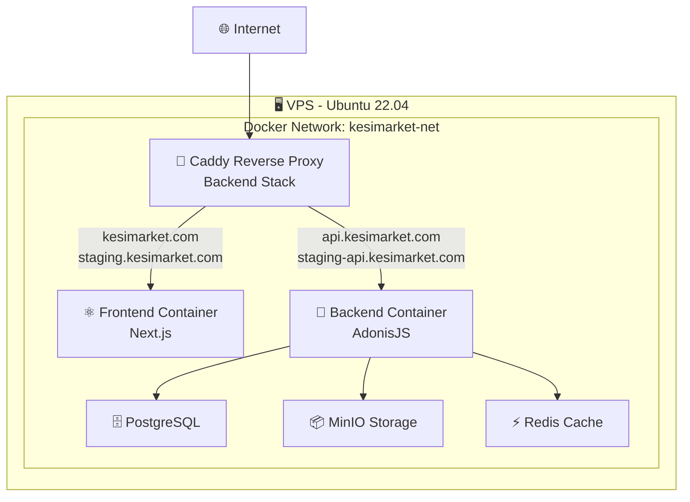

# 🚀 Déploiement Partagé - Frontend & Backend

Ce guide explique la nouvelle architecture de déploiement où **Caddy** (reverse proxy) est centralisé sur le backend et gère à la fois le frontend et l'API.

## 📋 Architecture

### Vue d'ensemble



### Domaines configurés

| Environnement | Frontend | API |
|---------------|----------|-----|
| **Production** | `kesimarket.com` | `api.kesimarket.com` |
| **Staging** | `staging.kesimarket.com` | `staging-api.kesimarket.com` |

## 🔧 Configuration

### 1. Réseau Docker Partagé

Les deux applications utilisent le réseau Docker `kesimarket-net` :

```bash
# Création du réseau (une seule fois)
docker network create kesimarket-net

# Ou utiliser le script automatique
./scripts/setup-docker-network.sh
```

### 2. Backend (avec Caddy)

Le backend inclut Caddy qui gère les deux applications :

```yaml
# kesimarket-modern-backend/docker-compose.prod.yml
networks:
  kesimarket-net:
    external: true

services:
  caddy:
    # Gère TOUS les domaines
    # kesimarket.com → frontend:3000
    # api.kesimarket.com → app:3333
```

### 3. Frontend (sans Caddy)

Le frontend ne contient plus Caddy, juste l'application Next.js :

```yaml
# kesimarket-modern/docker-compose.prod.yml
networks:
  kesimarket-net:
    external: true

services:
  frontend:  # Nom important pour Caddy
    image: kesimarket-frontend-prod:latest
```

## 🚀 Workflow de Déploiement

### Étape 1 : Setup initial (une seule fois)

```bash
# Sur le VPS
./scripts/setup-docker-network.sh
```

### Étape 2 : Déploiement Backend

```bash
# Depuis GitHub Actions ou manuellement
cd ~/kesimarket-modern/backend
docker-compose -f docker-compose.prod.yml up -d
```

### Étape 3 : Déploiement Frontend

```bash
# Depuis GitHub Actions ou manuellement  
cd ~/kesimarket-modern/frontend
docker-compose -f docker-compose.prod.yml up -d

# ⚠️ IMPORTANT: Redémarrer Caddy pour détecter le nouveau conteneur frontend
cd ~/kesimarket-modern/backend
docker restart kesimarket-caddy-prod
```

## 🔄 GitHub Actions

### Workflows modifiés

Les workflows GitHub Actions déploient maintenant :

1. **Backend Workflow** (`kesimarket-modern-backend`)
   - Build l'image backend
   - Déploie avec Caddy
   - Configure tous les domaines

2. **Frontend Workflow** (`kesimarket-modern`)
   - Build l'image frontend  
   - Déploie sur le réseau partagé
   - Se connecte automatiquement à Caddy

### Variables secrets GitHub

```bash
# Backend (existantes)
VPS_HOST=your.vps.ip
VPS_USER=ubuntu
VPS_SSH_KEY=your_private_key

# Frontend (nouvelles)
VPS_HOST=your.vps.ip  
VPS_USER=ubuntu
VPS_SSH_KEY=your_private_key
```

## 📁 Structure des dossiers VPS

```
~/kesimarket-modern/
├── backend/
│   ├── images/           # Images Docker backend
│   ├── logs/            # Logs Caddy (tous domaines)
│   ├── uploads/         # Fichiers application
│   ├── minio-data/      # Stockage MinIO
│   └── backups/         # Sauvegardes DB
└── frontend/
    └── images/          # Images Docker frontend
```

## ⚙️ Variables d'environnement

### Production (kesimarket-modern/.env.production)

```bash
NEXT_PUBLIC_API_URL=https://api.kesimarket.com
NEXTAUTH_URL=https://kesimarket.com
NEXT_PUBLIC_SITE_URL=https://kesimarket.com
```

### Staging (kesimarket-modern/.env.staging)

```bash
NEXT_PUBLIC_API_URL=https://staging-api.kesimarket.com
NEXTAUTH_URL=https://staging.kesimarket.com
NEXT_PUBLIC_SITE_URL=https://staging.kesimarket.com
```

## 🛡️ Sécurité Caddy

### Features configurées

- ✅ **SSL automatique** avec Let's Encrypt
- ✅ **Rate limiting** différentiel (prod vs staging)
- ✅ **Headers de sécurité** complets
- ✅ **CORS** configuré par environnement
- ✅ **Compression** Gzip/Brotli
- ✅ **Logs séparés** par domaine

### Limits configurées

| Service | Production | Staging |
|---------|------------|---------|
| API générale | 100 req/min | 200 req/min |
| Upload fichiers | 10 req/min | 20 req/min |
| Taille upload | 50MB | 50MB |

## 🔍 Monitoring & Logs

### Logs Caddy

```bash
# Logs par domaine
~/kesimarket-modern/backend/logs/
├── frontend-access.log          # kesimarket.com
├── api-access.log              # api.kesimarket.com  
├── staging-frontend-access.log # staging.kesimarket.com
└── staging-api-access.log      # staging-api.kesimarket.com
```

### Health Checks

```bash
# Frontend
curl https://kesimarket.com
curl https://staging.kesimarket.com

# API
curl https://api.kesimarket.com/health
curl https://staging-api.kesimarket.com/health
```

## 🐛 Dépannage

### Vérifier le réseau

```bash
docker network ls | grep kesimarket-net
docker network inspect kesimarket-net
```

### Vérifier les conteneurs

```bash
# Backend stack (avec Caddy)
cd ~/kesimarket-modern/backend
docker-compose -f docker-compose.prod.yml ps

# Frontend
cd ~/kesimarket-modern/frontend  
docker-compose -f docker-compose.prod.yml ps
```

### Vérifier la connectivité

```bash
# Depuis le conteneur Caddy
docker exec kesimarket-caddy-prod curl http://frontend:3000
docker exec kesimarket-caddy-prod curl http://app:3333/health
```

### Problème : Network kesimarket-net not found

**Symptôme** : `network kesimarket-net declared as external, but could not be found`

**Cause** : Le réseau partagé n'existe pas encore sur le VPS

**Solution** : Créer le réseau avant le déploiement
```bash
# Option 1: Script automatique
cd ~/kesimarket-modern/backend
./scripts/setup-docker-network.sh

# Option 2: Commande manuelle
docker network create kesimarket-net

# Vérifier
docker network ls | grep kesimarket-net
```

**Note** : Les workflows GitHub Actions créent automatiquement ce réseau, mais pour les déploiements manuels il faut le créer d'abord.

### Problème : Network exists but verification failed

**Symptôme** : 
```
out: ✅ Network 'kesimarket-net' already exists
err: Error response from daemon: network kesimarket-net not found
out: ❌ Network verification failed
```

**Cause** : **Faux positif** dans la détection - `grep` trouve quelque chose qui ressemble au réseau mais ce n'est pas le bon

**Solutions** :

#### 1. Script de nettoyage automatique (Recommandé)
```bash
cd ~/kesimarket-modern/backend
chmod +x scripts/cleanup-network.sh
./scripts/cleanup-network.sh
```

#### 2. Nettoyage manuel
```bash
# Voir tous les réseaux
docker network ls

# Supprimer le réseau corrompu
docker network rm kesimarket-net --force

# Recréer proprement
docker network create kesimarket-net --driver bridge

# Vérifier
docker network inspect kesimarket-net
```

#### 3. Reset complet Docker (en dernier recours)
```bash
# Arrêter tous les conteneurs kesimarket
docker stop $(docker ps -q -f name=kesimarket-) 2>/dev/null || true

# Nettoyer les réseaux
docker network prune -f

# Recréer le réseau
docker network create kesimarket-net --driver bridge
```

### Problème : Database not ready / service "db" is not running

**Symptôme** : 
```
out: Database not ready yet, waiting...
err: service "db" is not running
```

**Causes possibles** :
1. **Variables d'environnement manquantes** - Secrets GitHub non configurés
2. **Configuration incohérente** - DB_HOST pointe vers service externe au lieu du conteneur interne
3. **Locales PostgreSQL** - Problème avec les locales françaises sur Alpine Linux

**Solutions** :

#### 1. Vérifier les secrets GitHub
Variables requises dans GitHub Secrets :
```bash
# Database
DB_USER=kesimarket_user
DB_PASSWORD=your_secure_password
DB_DATABASE=kesimarket_modern

# MinIO  
MINIO_ACCESS_KEY=minioadmin
MINIO_SECRET_KEY=your_minio_secret_key
MINIO_BUCKET=kesimarket-storage

# Redis
REDIS_PASSWORD=your_redis_password

# Application
APP_KEY=your_32_character_secret_key
JWT_SECRET=your_jwt_secret_key
CORS_ORIGINS=https://kesimarket.com,https://staging.kesimarket.com
FRONTEND_URL=https://kesimarket.com
```

#### 2. Utiliser les services Docker internes
Dans le workflow, configurez :
```yaml
DB_HOST=db          # Pas d'IP externe
MINIO_HOST=minio    # Service interne
REDIS_HOST=redis    # Service interne
```

#### 3. Vérification manuelle
```bash
# Vérifier que PostgreSQL démarre
docker logs kesimarket-postgres-prod

# Tester la connexion
docker exec kesimarket-postgres-prod pg_isready -U your_user -d your_database

# Vérifier les variables d'environnement
docker exec kesimarket-postgres-prod env | grep POSTGRES
```

### Problème : Frontend pas accessible après déploiement

**Symptôme** : Le frontend ne répond pas sur `kesimarket.com` ou `staging.kesimarket.com`

**Solution** : Redémarrer Caddy après chaque déploiement frontend
```bash
cd ~/kesimarket-modern/backend
docker restart kesimarket-caddy-prod

# Vérifier que Caddy peut atteindre le frontend
docker exec kesimarket-caddy-prod curl -f http://frontend:3000
```

**Pourquoi ?** : Quand un nouveau conteneur frontend est créé, Caddy doit redémarrer pour détecter la nouvelle instance sur le réseau Docker.

### Logs en temps réel

```bash
# Caddy logs
docker logs -f kesimarket-caddy-prod

# Frontend logs
docker logs -f kesimarket-frontend-prod

# Backend logs  
docker logs -f kesimarket-backend-prod
```

## 🎯 Avantages de cette architecture

✅ **Un seul SSL** géré par Caddy  
✅ **Configuration centralisée** des domaines  
✅ **Rate limiting unifié**  
✅ **Logs centralisés**  
✅ **Déploiements indépendants** (frontend/backend)  
✅ **Scaling séparé** possible  
✅ **Maintenance simplifiée**

## 📚 Liens utiles

- [Guide Caddy](./kesimarket-modern-backend/CADDY.md)
- [Déploiement Backend](./kesimarket-modern-backend/DEPLOYMENT.md)
- [Configuration GitHub Actions](./GITHUB-SETUP.md) 