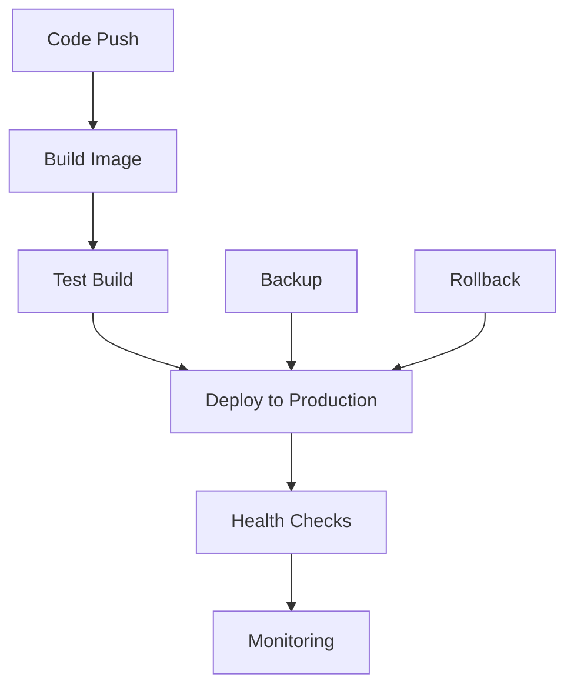

# 🚀 Configuration de Déploiement Frontend - KesiMarket Modern

## 📄 Résumé

Cette configuration de déploiement pour le frontend KesiMarket Modern est basée sur la configuration éprouvée du backend et adaptée pour Next.js.

## 🎯 Ce qui a été créé

### 📁 Fichiers de Configuration

| Fichier | Description | Basé sur Backend |
|---------|-------------|------------------|
| `Dockerfile` | Image Docker multi-stage optimisée | ✅ |
| `docker-compose.prod.yml` | Configuration Docker Compose production | ✅ |
| `Caddyfile` | Reverse proxy avec HTTPS automatique | ✅ |
| `docker-prod.sh` | Script de déploiement automatisé | ✅ |
| `env.production.example` | Variables d'environnement | ✅ |
| `.dockerignore` | Exclusions pour Docker | ✅ |

### 📁 Fichiers de Documentation

| Fichier | Description |
|---------|-------------|
| `DEPLOYMENT.md` | Guide complet de déploiement |
| `DOCKER.md` | Documentation Docker détaillée |
| `Makefile` | Commandes simplifiées |
| `docker-compose.override.yml` | Configuration développement |

### 🚀 API et Monitoring

| Fichier | Description |
|---------|-------------|
| `src/app/api/health/route.ts` | Endpoint de santé pour monitoring |

## 🔧 Comparaison Backend vs Frontend

### Similitudes ✅

- **Structure Docker identique** : Multi-stage build optimisé
- **Configuration Caddy** : Reverse proxy avec HTTPS automatique
- **Scripts de gestion** : Même interface pour déploiement/monitoring
- **Health checks** : Surveillance intégrée
- **Volumes persistants** : Données sécurisées
- **Variables d'environnement** : Configuration centralisée

### Adaptations Frontend 🔄

- **Next.js standalone** : Build optimisé pour conteneur
- **Health check API** : Endpoint Next.js natif
- **Variables NEXT_PUBLIC_** : Configuration client-side
- **Static assets** : Gestion optimisée des assets
- **NextAuth** : Configuration d'authentification

## 🚀 Démarrage Rapide

### 1. Configuration Initiale

```bash
# 1. Copier les variables d'environnement
cp env.production.example .env.production

# 2. Éditer les variables
nano .env.production

# 3. Générer les secrets
make secrets
# ou
./docker-prod.sh secrets

# 4. Configuration des répertoires
make setup
```

### 2. Déploiement

```bash
# Méthode 1: Avec Makefile
make deploy

# Méthode 2: Avec script
sudo ./docker-prod.sh deploy

# Méthode 3: Manuel
make build
make start
```

### 3. Vérification

```bash
# Statut des services
make status

# Health check
make health

# Logs
make logs
```

## 📊 Commandes Disponibles

### Makefile (Recommandé)

```bash
make help              # Afficher toutes les commandes
make build             # Construire l'image
make deploy            # Déploiement complet
make start/stop        # Gestion des services
make status            # Statut et health checks
make logs              # Voir les logs
make backup            # Créer une sauvegarde
make update            # Mise à jour
make scale-up          # Scaling horizontal
make monitor           # Surveillance temps réel
```

### Script Direct

```bash
./docker-prod.sh help  # Aide détaillée
./docker-prod.sh deploy
./docker-prod.sh status
./docker-prod.sh logs
./docker-prod.sh backup
./docker-prod.sh monitor
```

## 🔒 Variables d'Environnement Essentielles

```env
# Domaines (OBLIGATOIRE)
FRONTEND_DOMAIN=votre-domaine.com
NEXT_PUBLIC_API_URL=https://api.votre-domaine.com
NEXTAUTH_URL=https://votre-domaine.com

# Sécurité (OBLIGATOIRE)
NEXTAUTH_SECRET=votre_secret_32_caracteres

# SSL (OBLIGATOIRE)
ACME_EMAIL=admin@votre-domaine.com

# Application
NEXT_PUBLIC_APP_NAME="Votre App"
```

## 🌟 Features Clés

### ✅ Production Ready

- **HTTPS automatique** avec Let's Encrypt
- **Health checks** intégrés
- **Logging** structuré
- **Monitoring** en temps réel
- **Scaling** horizontal
- **Sauvegardes** automatiques

### ✅ Sécurité

- **Utilisateur non-root** dans les conteneurs
- **Headers de sécurité** automatiques
- **Secrets** gérés de manière sécurisée
- **Réseau isolé** Docker

### ✅ Performance

- **Image optimisée** (~100MB final)
- **Compression Gzip** automatique
- **Cache Docker** optimisé
- **Assets statiques** optimisés

### ✅ DevOps

- **Scripts automatisés** pour toutes les opérations
- **CI/CD ready** avec GitHub Actions
- **Monitoring** intégré
- **Rollback** facile

## 🔄 Workflow de Déploiement



## 📈 Monitoring et Maintenance

### Health Checks

```bash
# Automatique via Docker/Caddy
curl https://votre-domaine.com/api/health

# Monitoring continu
make monitor
```

### Logs

```bash
# Logs application
make logs-app

# Logs Caddy
make logs-caddy

# Logs temps réel
make logs-follow
```

### Sauvegardes

```bash
# Sauvegarde manuelle
make backup

# Automatique via cron
0 2 * * * cd /path/to/project && make backup
```

## 🆘 Dépannage

### Problèmes Courants

1. **Service inaccessible** → `make status` puis `make logs`
2. **Erreur SSL** → Vérifier `FRONTEND_DOMAIN` et `ACME_EMAIL`
3. **Build échoue** → `make clean` puis `make build`
4. **Performances** → `make monitor` pour surveillance

### Debug

```bash
# Mode debug
make debug

# Shell dans conteneur
make shell-app

# Reconstruire depuis zéro
make clean-all
make deploy
```

## 🎯 Prochaines Étapes

1. **Tester la configuration** localement
2. **Configurer le DNS** pour pointer vers votre serveur
3. **Déployer en production** avec `make deploy`
4. **Configurer les sauvegardes** automatiques
5. **Mettre en place le monitoring** avancé

## 📞 Support

- Consulter `DEPLOYMENT.md` pour le guide détaillé
- Consulter `DOCKER.md` pour la documentation technique
- Utiliser `make help` pour les commandes disponibles
- Vérifier les logs avec `make logs` en cas de problème

---

> 💡 **Note**: Cette configuration est identique en structure et fiabilité à celle du backend, garantissant une cohérence dans votre infrastructure de déploiement. 