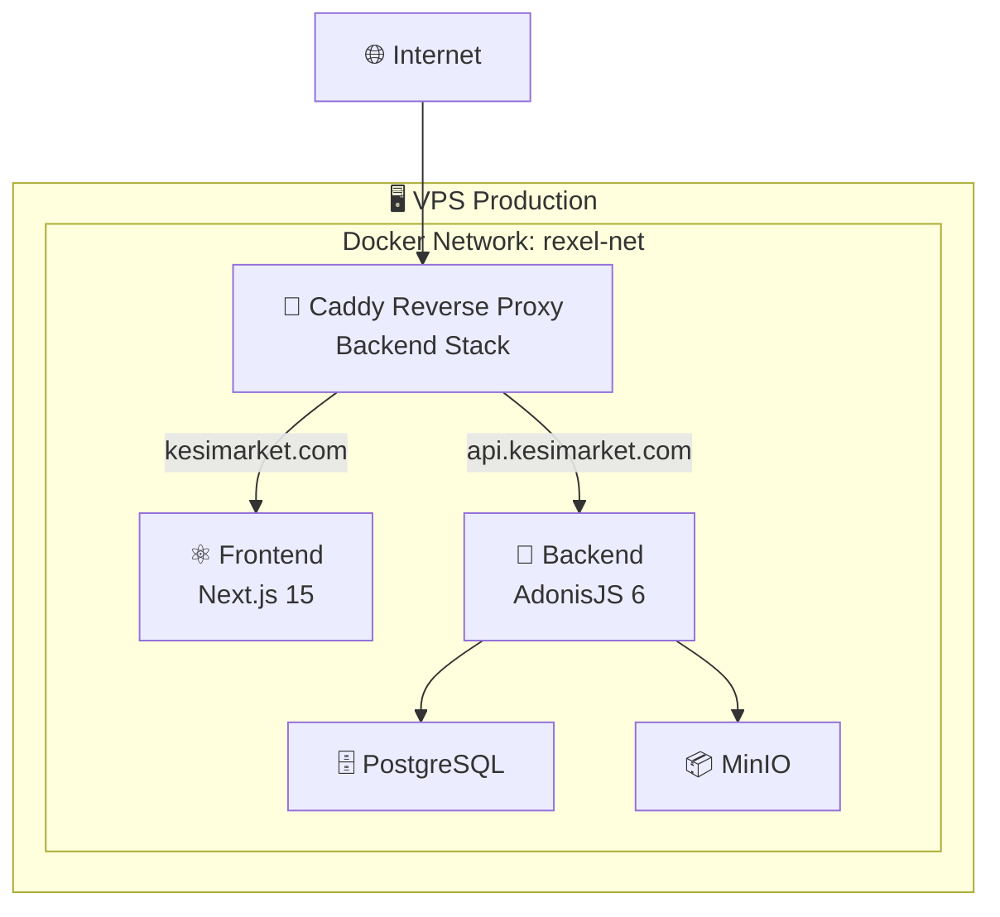

# 🚀 Rexel Modern - Frontend

Application e-commerce moderne développée avec **Next.js 15**, **TypeScript** et **TailwindCSS**.

## 📋 Architecture

Cette application frontend fait partie d'un système distribué avec une architecture reverse proxy partagée :



### 🌐 Domaines

| Environnement | Frontend | API |
|---------------|----------|-----|
| **Production** | [`kesimarket.com`](https://kesimarket.com) | [`api.kesimarket.com`](https://api.kesimarket.com) |
| **Staging** | [`staging.kesimarket.com`](https://staging.kesimarket.com) | [`staging-api.kesimarket.com`](https://staging-api.kesimarket.com) |

## 🛠️ Stack Technique

- **Framework** : Next.js 15 (App Router)
- **Language** : TypeScript 
- **Styling** : TailwindCSS + Shadcn/ui
- **State Management** : React Query (TanStack)
- **Auth** : NextAuth.js
- **HTTP Client** : Custom API client
- **Build** : Docker multi-stage
- **Deployment** : GitHub Actions → VPS

## 🚀 Démarrage Rapide

### Développement Local

```bash
# Installation des dépendances
npm install

# Variables d'environnement
cp .env.example .env.local

# Démarrage en mode développement
npm run dev
```

L'application sera disponible sur [`http://localhost:3000`](http://localhost:3000)

### Variables d'Environnement

```bash
# API Configuration
NEXT_PUBLIC_API_URL=http://localhost:3333

# NextAuth
NEXTAUTH_URL=http://localhost:3000
NEXTAUTH_SECRET=your_secret_here
```

## 🐳 Docker

### Build Local

```bash
# Build l'image Docker
docker build -t rexel-frontend .

# Run en local
docker run -p 3000:3000 rexel-frontend
```

### Production avec Réseau Partagé

```bash
# 1. Créer le réseau partagé
docker network create rexel-net

# 2. Déployer le backend avec Caddy
cd ../rexel-modern-backend
docker-compose -f docker-compose.prod.yml up -d

# 3. Déployer le frontend  
docker-compose -f docker-compose.prod.yml up -d
```

## 🔄 CI/CD avec GitHub Actions

### Workflow Automatique

Le déploiement est automatisé via GitHub Actions :

```yaml
# Déclencheurs
- Push sur main → Production
- Workflow manuel → Production/Staging
```

### Variables Secrets GitHub

Configurer dans `Settings > Secrets and variables > Actions` :

```bash
# VPS Access
VPS_HOST=your.vps.ip
VPS_USER=ubuntu
VPS_SSH_PRIVATE_KEY=your_private_key

# Application
NEXT_PUBLIC_APP_NAME=Rexel Modern
NEXT_PUBLIC_API_URL=https://api.kesimarket.com
NEXTAUTH_URL=https://kesimarket.com
NEXTAUTH_SECRET=your_secret

# Staging (optionnel)
NEXTAUTH_SECRET_STAGING=your_staging_secret
```

### Déploiement Manuel

```bash
# Via GitHub Actions
1. Aller dans Actions tab
2. Sélectionner "Deploy Frontend to Production" 
3. Choisir l'environnement (production/staging)
4. Run workflow
```

## 📁 Structure du Projet

```
src/
├── app/                    # App Router (Next.js 13+)
│   ├── (routes)/          # Pages de l'application
│   ├── api/               # API Routes Next.js
│   ├── globals.css        # Styles globaux
│   └── layout.tsx         # Layout principal
├── components/            # Composants React
│   ├── ui/               # Composants de base (Shadcn)
│   ├── layout/           # Header, Footer, Navigation
│   └── sections/         # Sections de pages
├── lib/                  # Utilitaires et configuration
│   ├── api/             # Client API
│   ├── auth/            # Configuration NextAuth
│   └── utils.ts         # Fonctions utilitaires
```

## 🔗 Intégration Backend

### Client API

```typescript
// lib/api/client.ts
import { createApiClient } from './client'

const api = createApiClient({
  baseURL: process.env.NEXT_PUBLIC_API_URL
})

// Usage
const products = await api.products.getAll({
  page: 1,
  per_page: 20
})
```

### Types Synchronisés

Les types TypeScript sont synchronisés avec le backend AdonisJS :

```typescript
// lib/api/types.ts
export interface Product {
  id: number
  name: string
  price: number
  category: Category
  brand: Brand
}
```

## 🛡️ Sécurité

### Headers de Sécurité

Gérés par Caddy (backend) :
- HSTS
- CSP
- X-Frame-Options
- X-Content-Type-Options

### Authentification

```typescript
// NextAuth configuration
import NextAuth from 'next-auth'

export default NextAuth({
  providers: [...],
  callbacks: {
    jwt: ({ token, user }) => ({ ...token, ...user }),
    session: ({ session, token }) => ({ ...session, user: token })
  }
})
```

## 📊 Performance

### Optimisations Next.js

- **Output** : `standalone` pour Docker
- **Images** : `next/image` avec optimisation
- **Bundle Analyzer** : Analyse des bundles
- **Static Generation** : Pages statiques quand possible

### Métriques

- **Lighthouse Score** : 90+ 
- **Core Web Vitals** : Conformes
- **Bundle Size** : < 200KB gzipped

## 🧪 Tests

```bash
# Tests unitaires
npm run test

# Tests E2E
npm run test:e2e

# Linting
npm run lint

# Type checking
npm run type-check
```

## 📚 Documentation

- [📋 Architecture Partagée](./DEPLOYMENT-SHARED.md)
- [🔧 Configuration GitHub Actions](./GITHUB-SETUP.md)
- [⚙️ Variables d'Environnement](./env.production.example)
- [🧩 Backend API](../rexel-modern-backend/README.md)

## 🚧 Développement

### Scripts Disponibles

```bash
npm run dev          # Démarrage développement
npm run build        # Build production
npm run start        # Start production
npm run lint         # ESLint
npm run type-check   # TypeScript check
```

### Conventions de Code

- **ESLint** : Configuration stricte
- **Prettier** : Formatage automatique  
- **TypeScript** : Mode strict activé
- **Commits** : Conventional Commits

## 🔄 Roadmap

- [ ] **PWA** : Service Worker + Manifest
- [ ] **Internationalisation** : Support multi-langues
- [ ] **Testing** : Couverture complète E2E
- [ ] **Analytics** : Intégration Google Analytics
- [ ] **Monitoring** : Sentry pour le error tracking

## 📞 Support

- **Issues** : [GitHub Issues](../../issues)
- **Discussions** : [GitHub Discussions](../../discussions)
- **Documentation** : [Wiki](../../wiki)

---

**🚀 Déployé avec GitHub Actions sur VPS Ubuntu 22.04**
