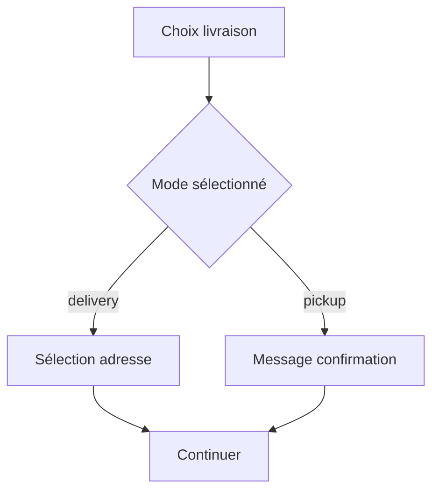
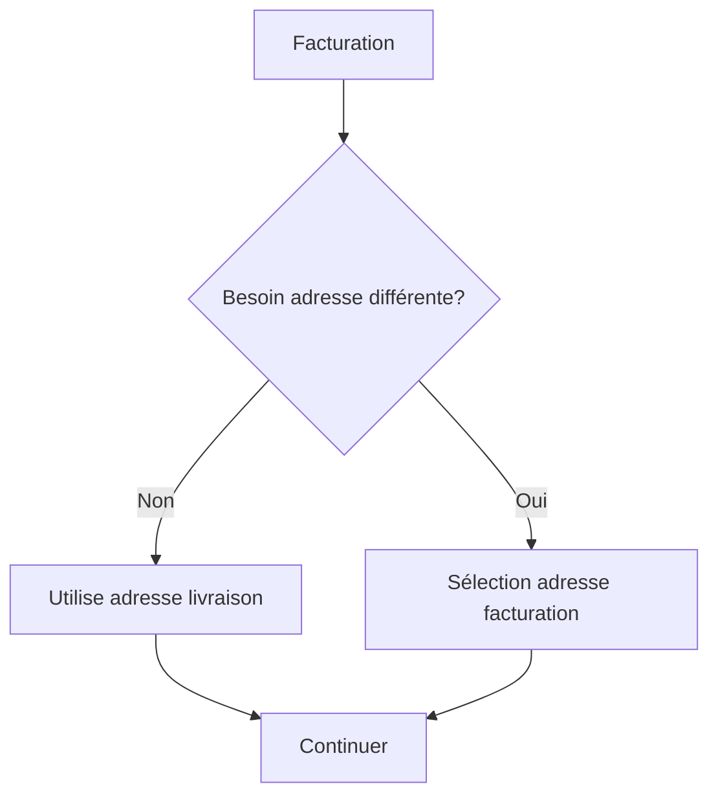

# Architecture Livraison vs Retrait en Boutique

## Vue d'ensemble

Refactorisation complète du système de livraison pour intégrer le choix "Retrait en boutique" dans la carte d'adresse de livraison et rendre l'adresse de facturation optionnelle.

## Architecture finale

### 🚛 Choix du mode de livraison
Intégré dans `ShippingAddressCard` avec deux options :
- **Livraison à domicile** : Nécessite une adresse de livraison
- **Retrait en boutique** : Gratuit, prêt en 2h, aucune adresse requise

### 📧 Adresse de facturation optionnelle
Dans `BillingAddressCard` avec une checkbox :
- Par défaut : Utilise l'adresse de livraison pour la facturation
- Optionnel : Adresse de facturation différente pour les factures

## Composants refactorisés

### 1. ShippingAddressCard
```tsx
interface ShippingAddressCardProps {
  // ... propriétés existantes
  deliveryMethod: 'delivery' | 'pickup';
  onDeliveryMethodChange: (method: 'delivery' | 'pickup') => void;
}
```

**Fonctionnalités :**
- ✅ **RadioGroup** : Choix livraison/retrait
- ✅ **Conditionnelle** : AddressSelector seulement si livraison
- ✅ **Message informatif** : Retrait en boutique avec détails
- ✅ **Icônes** : Truck (livraison) + Store (retrait)

**Structure :**
```tsx
<Card title="Options de livraison">
  <RadioGroup value={deliveryMethod} onValueChange={onDeliveryMethodChange}>
    <RadioGroupItem value="delivery" /> Livraison à domicile
    <RadioGroupItem value="pickup" /> Retrait en boutique
  </RadioGroup>
  
  {deliveryMethod === 'delivery' && (
    <AddressSelector type="shipping" />
  )}
  
  {deliveryMethod === 'pickup' && (
    <InfoMessage>Prêt en 2h - SMS de confirmation</InfoMessage>
  )}
</Card>
```

### 2. BillingAddressCard  
```tsx
interface BillingAddressCardProps {
  // ... propriétés existantes
  needsBillingAddress: boolean;
  onNeedsBillingAddressChange: (value: boolean) => void;
  deliveryMethod: 'delivery' | 'pickup';
}
```

**Fonctionnalités :**
- ✅ **Checkbox** : "J'ai besoin d'une facture avec une adresse différente"
- ✅ **Conditionnelle** : BillingAddressSelector seulement si nécessaire
- ✅ **Messages adaptatifs** : Différents selon le mode de livraison
- ✅ **Icône** : FileText pour la facturation

**Structure :**
```tsx
<Card title="Adresse de facturation" subtitle="Optionnel">
  <Checkbox 
    checked={needsBillingAddress}
    onCheckedChange={onNeedsBillingAddressChange}
  >
    J'ai besoin d'une facture avec une adresse différente
  </Checkbox>
  
  {needsBillingAddress && (
    <BillingAddressSelector />
  )}
  
  {!needsBillingAddress && (
    <InfoMessage deliveryMethod={deliveryMethod} />
  )}
</Card>
```

## Types et états

### États principaux dans CartPage
```tsx
const [deliveryMethod, setDeliveryMethod] = useState<'delivery' | 'pickup'>('delivery');
const [needsBillingAddress, setNeedsBillingAddress] = useState(false);
```

### Logique de validation
```tsx
// Adresse de livraison requise seulement si livraison à domicile
const isShippingRequired = deliveryMethod === 'delivery';

// Adresse de facturation requise seulement si explicitement demandée
const isBillingRequired = needsBillingAddress;
```

## Flux utilisateur

### 1. Sélection du mode de livraison


### 2. Gestion de la facturation


## Messages utilisateur

### Retrait en boutique sélectionné
```tsx
<InfoMessage>
  Votre commande sera préparée et vous recevrez un SMS 
  dès qu'elle sera prête à être récupérée.
</InfoMessage>
```

### Pas d'adresse de facturation
```tsx
{deliveryMethod === 'pickup' 
  ? "Aucune adresse de facturation requise pour le retrait en boutique"
  : "L'adresse de livraison sera utilisée pour la facturation"
}
```

## Validation du formulaire

### Règles de validation
1. **Livraison à domicile** : Adresse de livraison obligatoire
2. **Retrait en boutique** : Aucune adresse requise
3. **Facturation** : Optionnelle sauf si explicitement demandée

### Conditions pour continuer
```tsx
const canContinue = () => {
  // Retrait en boutique : toujours OK
  if (deliveryMethod === 'pickup') return true;
  
  // Livraison : adresse requise
  if (deliveryMethod === 'delivery' && !selectedShippingAddress) return false;
  
  // Facturation : seulement si demandée
  if (needsBillingAddress && !selectedBillingAddress && !useSameAsShipping) return false;
  
  return true;
};
```

## Icônes utilisées

### Livraison
- `<Truck />` : Livraison à domicile
- `<Store />` : Retrait en boutique
- `<FileText />` : Facturation

### Tailles standardisées
- **Options principales** : `w-5 h-5` (20px)
- **Messages** : `w-4 h-4` (16px)

## Suppression de la duplication

### ❌ Ancienne section supprimée
La section "Options de livraison" en bas du formulaire a été supprimée car intégrée dans `ShippingAddressCard`.

### ✅ Centralisation
- **Un seul endroit** : Choix livraison/retrait dans ShippingAddressCard
- **Logique unifiée** : deliveryMethod gère tout le comportement
- **UX cohérente** : Pas de confusion entre deux sélecteurs

## Avantages de l'architecture

### 🎯 UX simplifiée
- **Workflow logique** : Mode → Adresse → Facturation
- **Moins d'étapes** : Choix groupés par thématique
- **Messages clairs** : Information contextuelle

### 🔧 Code maintenable
- **État centralisé** : deliveryMethod contrôle l'affichage
- **Validation simple** : Règles claires et cohérentes
- **Composants spécialisés** : Chaque carte a sa responsabilité

### 📱 Responsive
- **Cards uniformes** : Même structure sur mobile/desktop
- **Icônes adaptées** : Tailles optimisées pour chaque écran
- **Messages adaptatifs** : Contenu contextuel selon le mode

Le système est maintenant **logique, optionnel et cohérent** ! 🎯✨
