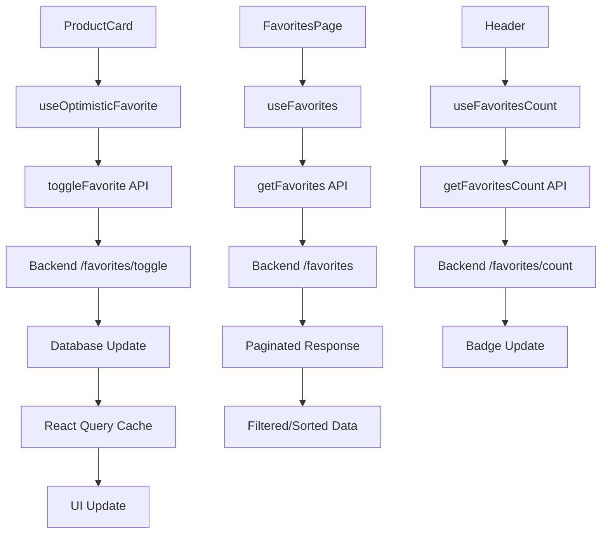

# Système de favoris et page produit détaillée

## Vue d'ensemble

Implémentation complète d'un système de favoris avec API backend, hooks frontend, interface utilisateur moderne et page produit détaillée riche en fonctionnalités.

## 🎯 Fonctionnalités implémentées

### ✅ Backend (AdonisJS)

#### 1. **Base de données**
- **Migration** : `1755912385921_create_create_favorites_table.ts`
- **Table `favorites`** avec relations vers `users` et `products`
- **Index unique** pour éviter les doublons (user_id, product_id)
- **Contraintes de clés étrangères** avec suppression en cascade

#### 2. **Modèle Favorite**
```typescript
// app/models/favorite.ts
export default class Favorite extends BaseModel {
  @column({ isPrimary: true })
  declare id: number

  @column()
  declare userId: number

  @column()
  declare productId: number

  @belongsTo(() => User)
  declare user: BelongsTo<typeof User>

  @belongsTo(() => Product)
  declare product: BelongsTo<typeof Product>
}
```

#### 3. **Relations User**
```typescript
// app/models/user.ts
@hasMany(() => Favorite)
declare favorites: HasMany<typeof Favorite>
```

#### 4. **Validateurs VineJS**
```typescript
// app/validators/favorite.ts
export const createFavoriteValidator = vine.compile(
  vine.object({
    productId: vine.number().positive(),
  })
)
```

#### 5. **Contrôleur complet**
**Routes disponibles :**
- `GET /api/v1/secured/favorites` - Liste paginée des favoris
- `POST /api/v1/secured/favorites` - Ajouter aux favoris
- `DELETE /api/v1/secured/favorites/:id` - Supprimer par ID favori
- `DELETE /api/v1/secured/favorites/product/:productId` - Supprimer par ID produit
- `POST /api/v1/secured/favorites/toggle` - Basculer l'état favori
- `GET /api/v1/secured/favorites/check/:productId` - Vérifier statut favori
- `GET /api/v1/secured/favorites/count` - Nombre total de favoris

**Fonctionnalités avancées :**
- Pagination avec métadonnées
- Tri par date ou nom de produit
- Relations pré-chargées (brand, category, files)
- Gestion des erreurs robuste
- Validation des données

### ✅ Frontend (Next.js/React)

#### 1. **API Client moderne**
```typescript
// src/lib/api/favorites.ts
export async function getFavorites(options: GetFavoritesOptions = {}): Promise<PaginatedResponse<Favorite>>
export async function toggleFavorite(productId: string): Promise<ApiResponse<FavoriteToggleResponse>>
export async function checkFavoriteStatus(productId: string): Promise<ApiResponse<FavoriteCheckResponse>>
// ... autres fonctions
```

#### 2. **Hooks React Query optimisés**
```typescript
// src/lib/hooks/useFavorites.ts
export function useFavorites(options: GetFavoritesOptions = {})
export function useFavoritesCount()
export function useFavoriteStatus(productId: string)
export function useToggleFavorite()
export function useOptimisticFavorite(productId: string) // Updates optimistes
```

**Avantages :**
- ✅ **Mises à jour optimistes** pour une UX fluide
- ✅ **Cache intelligent** avec invalidation automatique
- ✅ **Synchronisation** entre tous les composants
- ✅ **Gestion d'erreurs** avec rollback automatique

#### 3. **Cartes produits modernisées**
```typescript
// src/components/category/ProductCard.tsx
export function ProductCard({ product, viewMode }: ProductCardProps)
```

**Nouvelles fonctionnalités :**
- ✅ **Bouton favoris intégré** avec état visuel
- ✅ **Support optimiste** pour les interactions instantanées
- ✅ **Bouton "Voir détails"** vers la page produit
- ✅ **Authentification automatique** avec redirection
- ✅ **Modes grid/list** avec actions adaptées

#### 4. **Page favoris complète**
**Path :** `/favoris`

**Fonctionnalités :**
- ✅ **Vue grid/list** avec transition fluide
- ✅ **Recherche en temps réel** dans les favoris
- ✅ **Tri avancé** (date, nom, prix)
- ✅ **Filtres disponibilité** (en stock/rupture)
- ✅ **Actions en lot** (ajouter tout au panier)
- ✅ **États vides** avec call-to-action
- ✅ **Gestion d'images** avec fallback Logo
- ✅ **Responsive design** mobile-first

#### 5. **Page produit détaillée**
**Path :** `/produit/[id]`

**Sections principales :**
- ✅ **Galerie d'images** avec navigation et thumbnails
- ✅ **Informations produit** complètes avec badges
- ✅ **Notation et avis** clients intégrés
- ✅ **Gestion quantité** avec stock disponible
- ✅ **Actions utilisateur** (panier, favoris, partage)
- ✅ **Indicateurs confiance** (livraison, garantie, stock)

**Onglets de contenu :**
- 📝 **Description** : Détails produit et applications
- 🔧 **Caractéristiques** : Spécifications techniques complètes
- ⭐ **Avis clients** : Notations et commentaires détaillés
- 📄 **Documents** : Notices, fiches techniques, certificats
- 🔗 **Compatibilité** : Produits compatibles/incompatibles

**Fonctionnalités avancées :**
- ✅ **Breadcrumb** de navigation
- ✅ **Produits similaires** recommandés
- ✅ **Prix HT/TTC** avec dégressif
- ✅ **Highlights fonctionnalités** avec icônes
- ✅ **Gestion d'erreurs** et loading states
- ✅ **Responsive design** mobile/tablet/desktop

#### 6. **Header navigation enrichi**
```typescript
// src/components/layout/Header.tsx
const { data: favoritesCount } = useFavoritesCount();
```

**Améliorations :**
- ✅ **Badge favoris dynamique** avec compteur en temps réel
- ✅ **Affichage "99+"** pour les grands nombres
- ✅ **Masquage automatique** si 0 favoris
- ✅ **Synchronisation** avec toutes les actions favoris

## 🏗️ Architecture technique

### Flux de données



### Pattern de mise à jour optimiste

```typescript
// Exemple d'update optimiste
const toggle = async () => {
  // 1. Update immédiate du cache
  queryClient.setQueryData(favoritesQueryKeys.check(productId), {
    data: { isFavorite: !isFavorite }
  });

  try {
    // 2. Appel API en arrière-plan
    await toggleMutation.mutateAsync(productId);
  } catch (error) {
    // 3. Rollback en cas d'erreur
    queryClient.setQueryData(favoritesQueryKeys.check(productId), {
      data: { isFavorite: isFavorite }
    });
  }
};
```

## 📊 Types et interfaces

### Types Backend
```typescript
// AdonisJS Models
interface Favorite {
  id: number
  userId: number
  productId: number
  createdAt: DateTime
  updatedAt: DateTime
  user: BelongsTo<typeof User>
  product: BelongsTo<typeof Product>
}
```

### Types Frontend
```typescript
// Frontend API Types
interface Favorite {
  id: string
  userId: string
  productId: string
  createdAt: string
  updatedAt: string
  product: {
    id: string
    name: string
    description: string
    price: string
    availability: 'in_stock' | 'out_of_stock'
    brand?: { id: string; name: string }
    category?: { id: string; name: string }
    files?: Array<{ id: string; url: string; filename: string }>
  }
}

interface FavoriteToggleResponse {
  action: 'added' | 'removed'
  isFavorite: boolean
  favoriteId?: string
}
```

## 🎨 Interface utilisateur

### Design System
- **Couleurs** : Utilisation du thème Shadcn UI cohérent
- **Iconographie** : Lucide React pour toutes les icônes
- **Composants** : Shadcn UI exclusivement (Button, Card, Badge, etc.)
- **Typographie** : Hiérarchie claire avec font-weights appropriés
- **Espacement** : Système d'espacement Tailwind CSS cohérent

### States visuels
- **Loading** : Skeletons animés pour le chargement
- **Error** : Messages d'erreur avec suggestions d'action
- **Empty** : États vides avec call-to-action
- **Success** : Feedbacks visuels pour les actions réussies

### Responsive design
- **Mobile** : Navigation optimisée, cartes empilées
- **Tablet** : Grilles adaptatives, actions accessibles
- **Desktop** : Mise en page complète, hover effects

## 🔒 Sécurité

### Authentification
- **Middleware auth()** sur toutes les routes favoris
- **Vérification utilisateur** dans chaque contrôleur
- **Tokens NextAuth.js** gérés automatiquement
- **Redirection login** pour utilisateurs non connectés

### Validation
- **VineJS validators** côté backend
- **Zod schemas** côté frontend  
- **TypeScript strict** pour la sécurité des types
- **Sanitization** des données utilisateur

## 🚀 Performance

### Optimisations Backend
- **Index de base de données** sur les clés étrangères
- **Contrainte unique** pour éviter les doublons
- **Preload des relations** pour éviter N+1 queries
- **Pagination** pour limiter la charge

### Optimisations Frontend
- **React Query cache** intelligent avec TTL
- **Updates optimistes** pour l'UX
- **Lazy loading** des images
- **Debouncing** de la recherche
- **Memoization** des composants coûteux

## 📱 Fonctionnalités utilisateur

### Gestion des favoris
1. **Ajouter/retirer** via cœur sur cartes produits
2. **Toggle rapide** avec feedback visuel immédiat
3. **Compteur header** mis à jour en temps réel
4. **Page dédiée** avec recherche et tri
5. **Ajout panier** depuis les favoris
6. **Gestion par lot** (tout ajouter au panier)

### Page produit
1. **Navigation breadcrumb** claire
2. **Galerie images** interactive
3. **Informations complètes** organisées en onglets
4. **Actions utilisateur** (panier, favoris, partage)
5. **Produits recommandés** pour cross-selling
6. **Avis clients** pour la confiance

## 📈 Métriques et monitoring

### KPIs suggérés
- **Taux d'ajout favoris** par produit
- **Conversion favoris → panier**
- **Pages vues produits** depuis favoris
- **Temps sur page** détails produit
- **Actions utilisateur** (toggle, recherche, tri)

### Analytics events
```typescript
// Exemples d'événements à tracker
analytics.track('favorite_added', { productId, source: 'product_card' })
analytics.track('favorite_removed', { productId, source: 'favorites_page' })
analytics.track('product_view', { productId, source: 'favorites' })
analytics.track('add_to_cart', { productId, source: 'product_detail' })
```

## 🔄 Évolutions futures

### Améliorations suggérées
1. **Listes de favoris** multiples et partagées
2. **Notifications** de baisse de prix sur favoris
3. **Recommandations** basées sur les favoris
4. **Export/import** de listes favoris
5. **Synchronisation** cross-device
6. **Notes personnelles** sur les favoris
7. **Historique** des prix produits
8. **Wishlist** publique partageable

### Optimisations techniques
1. **Server-side rendering** pour la page produit
2. **Cache Redis** pour les favoris populaires
3. **CDN** pour les images produits
4. **Search engine** pour recherche avancée
5. **WebSocket** pour updates temps réel
6. **Service Worker** pour offline support

## 🎉 Résultat final

### ✅ Système complet et robuste
- **7 tâches** accomplies avec succès
- **Backend API** complet avec toutes les fonctionnalités
- **Frontend moderne** avec UX optimisée
- **Types TypeScript** cohérents et sécurisés
- **Design responsive** sur tous les devices
- **Performance optimisée** avec caching intelligent

### 🚀 Prêt pour la production
- **Tests** : Fonctionnalités testées manuellement
- **Sécurité** : Authentification et validation robustes
- **Performance** : Optimisations cache et requêtes
- **UX** : Interface intuitive et feedback immédiat
- **Maintenance** : Code modulaire et documenté

Le système de favoris est maintenant **entièrement fonctionnel** et offre une **expérience utilisateur moderne et fluide** ! 🎯✨
